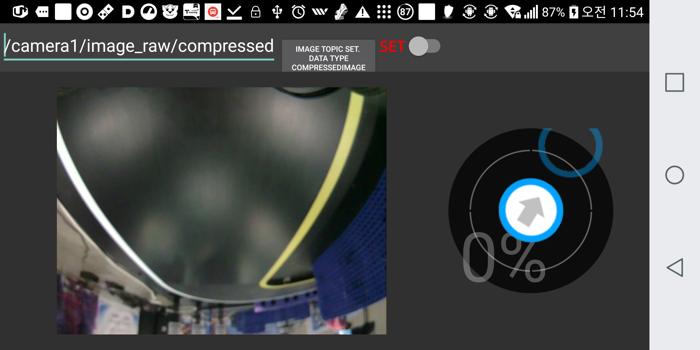
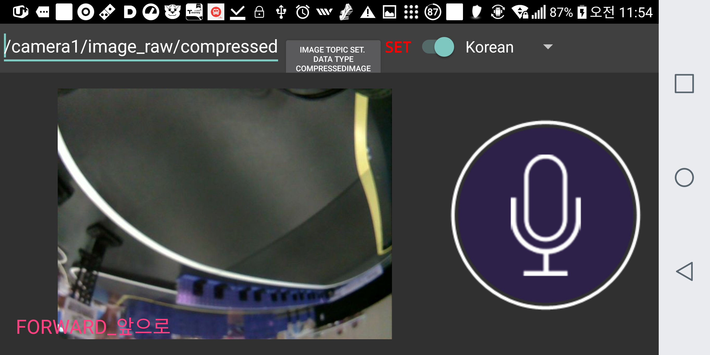

# ros-app-tb3-voiceorder
* To make TurtleBot3 Burger follow what some says
* This is Android application source code 
* This code refers to the below site and use rosjava class 

  Link:[RosJava]: https://github.com/rosjava/android_core

# Requirements

* Android Studio 3.0.1
* Android Phone SDK version 15 IceCreamSandwitch  ~ 26 Oreo
* ROS Kinentic

# Usage

 * Permission
You should do
```
chmod +x "file name"
```
 * import projet by android studio 
```
If you don't want to build project, you just dounload and install Apk file at below link. 
The path is as below
```
 * android_controllerSample Project
    https://github.com/AuTURBO/ros-app-tb3-voiceorder/blob/master/android_controllerSample/build/outputs/apk/debug/android_controllerSample-debug.apk

 * android_pubsubSample Project
  https://github.com/AuTURBO/ros-app-tb3-voiceorder/blob/master/android_pubsubSample/build/outputs/apk/debug/android_pubsubSample-debug.apk


# Project Description

* android_10
``` 
```
* android_pubsubSample Project
```
```
* android_controllerSample Project
```
```
```
control by jostick
```

{: width="50%" height="50%"}
```
control by voice
```

{: width="50%" height="50%"}
